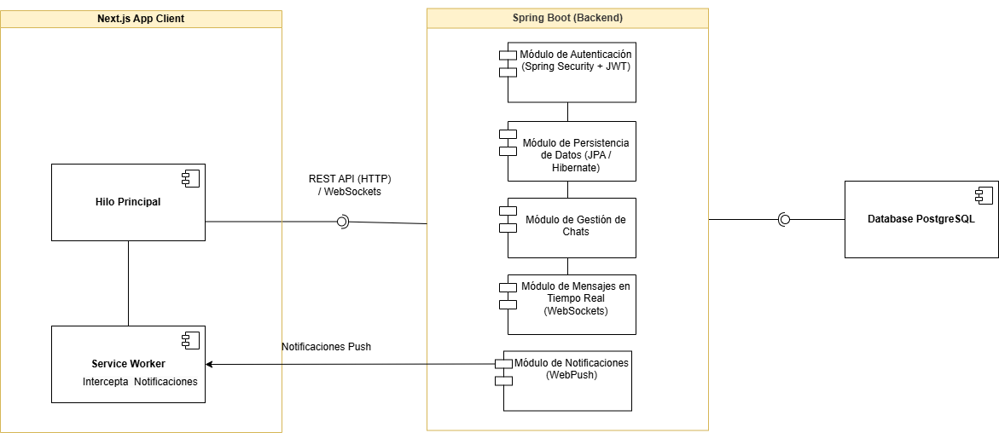

# Proyecto de Chat en Tiempo Real

## Descripción

Este proyecto es una aplicación de chat en tiempo real desarrollada con **Spring Boot** en el backend y **Next.js** en el frontend. La aplicación permite a los usuarios registrarse, iniciar sesión y comunicarse en tiempo real, mostrando el estado de los mensajes como enviados, entregados o vistos.

## Características

- **Autenticación**: Registro y inicio de sesión de usuarios mediante JWT y Spring Security.
- **Chat en Tiempo Real**: Mensajes se envían y reciben en tiempo real utilizando WebSocket.
- **Estados de Mensajes**: Visualización de estados de mensajes (enviado, entregado, visto).
- **Lista de Chats**: Muestra los chats del usuario y los usuarios conectados.
- **Funcionalidad de Archivar Chats**: Opción para archivar chats y mantener la lista organizada.
- **Responder Mensajes**: Capacidad de responder a mensajes específicos en una conversación.
- **Información de Chats/Mensajes**: Visualización de detalles sobre chats y mensajes.
- **Notificaciones en Tiempo Real**: Indicadores visuales de nuevos mensajes.

## Tecnologías Utilizadas

### **Backend:**

- Java 21 + Spring Boot
- Spring Security (JWT)
- WebSockets (STOMP)
- PostgreSQL
- JPA / Hibernate

### **Frontend:**

- Next.js (React)
- TypeScript
- Tailwind CSS
- Axios (para peticiones HTTP)
- Socket.io (para WebSockets)

### **Extras:**

- Service Workers para notificaciones push
- Axios para manejo eficiente de peticiones HTTP

## Arquitectura del Proyecto



## Diagrama Relacional de Base de Datos


## Cómo Probar la Aplicación

### Requisitos previos

- Docker y Docker Compose

### Configuración Inicial

1. Clona el repositorio

   ```bash
   git clone https://github.com/PepeBeto-code/redes-p1.git
   cd redes-p1
   ```

2. Configura las variables de entorno

   - Crea un archivo .env en ./api y ./chat-live-client basado en los archivos de ejemplo (.env.example).

   - Asegúrate de definir correctamente las credenciales de la base de datos y JWT.

   - Cambia la **apiUrl** por **apiDocker** en ./chat-live-client/src/Variables/ApiVariables.mjs

### Ejecutar con Docker

Para ejecutar la aplicación completa con Docker:

```bash
docker-compose up --build -d
```

Esto hará lo siguiente:

- Construirá los contenedores de Backend, Frontend, Base de Datos y Nginx.
- La aplicación estará disponible en [http://localhost:3000](http://localhost:3000).
- La API estará disponible en [http://localhost:8080](http://localhost:8080).

Para detener la aplicación:

```bash
docker-compose down --rmi all -v --remove-orphans
```

## Pruebas

1. Registro/Login

   - La aplicación ya tiene dos usuarios creados para pruebas:

     - **Usuario:** pepe → **Contraseña:** Pepe123

     - **Usuario:** toño → **Contraseña:** Tono123

   - Inicia sesión con cualquiera de ellos para probar la autenticación.

2. Chat en tiempo real

   - Inicia sesión con ambos usuarios en **diferentes navegadores o pestañas**.

   - Envía un mensaje desde **pepe** a **toño** y verifica que se reciba en tiempo real.

   - Responde desde **toño** a **pepe** y revisa la actualización inmediata.

3. Verificación de JWT

   - Usa herramientas como Postman o curl para probar las rutas protegidas.

   - Prueba hacer una solicitud GET a:

   ```bash
   http://localhost:8080/auth/login
   ```

   - Asegúrate de incluir el **token JWT** en los headers para acceder.

   ## Capturas


